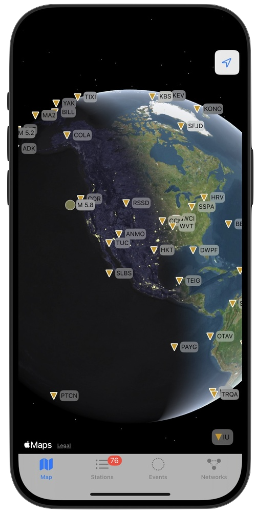

# Wiggles - your seismic station App

<!--  -->

  
  

Wiggles visualizes ground motion recorded by seismic stations.
The App is a native iOS and iPadOS application built entirely with Swift, designed for near-realtime seismic waveform visualization and analysis. It provides researchers, educators, and seismic enthusiasts with direct access to global seismic data through FDSN web services, offering an intuitive way to explore detailed station information, earthquake events, and interactive waveform charts.  
Select your preferred data source and station networks - from global to local arrays - accessing one of the highest-quality geophysical measurement systems ever built. These devices typically measure motions at nanometer scale, the size of molecules.  
If you're using this tool for research or education, feel free to reach out with suggestions!
  

---

## Development

### Idea

My main curiosity was to find out how current ground motion looks like around where I live. Thus, I was trying to see if there is a way to find a nearby seismometer of the national seismic network and get a visual on its waveform recording on my phone. Something like a weather app, but for seismics. The best I could find was a webpage of the [IRIS station monitor](https://www.iris.edu/app/station_monitor/). And, bummer, the mobile app installation doesn't work for my region. So, I set out to code my own little tool, getting some experience with Swift programming along the way. The result is Wiggles, an iOS and iPadOS app, now available for free on the App Store :)

This endavour wouldn't have been possible without the openly accessible [FDSN web services](https://www.fdsn.org). All these FDSN servers provide public access to high-quality seismometer informations, waveform data as well as seismic events -  pretty incredible.

### About the Wiggles App

### 🌟 Key Features

- **FDSN Network Selection**:
  Tailor your data sources by selecting from various FDSN clients and applying specific network filters to focus on regions of interest.

  Currently supported FDSN web clients are:

    | Client | Center |
    |--------|--------|
    | IRIS   | IRIS Data Management Centre |
    | ETH    | Swiss ETH Data Centre |
    | GEOFON | German GEOFON (GEOFOrschungsNetz) program |
    | INGV   | Italian INGV Data Centre |
    | NCEDC  | Northern California Earthquake Data Center |
    | SCEDC  | Southern California Earthquake Data Center |
    | NOA    | Greece National Observatory of Athens (NOA) |
    | ORFEUS | Observatories & Research Facilities for European Seismology (ORFEUS) |
    | RESIF  | French RESIF (Reseau sismologique & geodesique francais) |

  Each client comes with a set of predefined networks to select from, giving you access to global and local seismic stations.

- **Location-Aware Station Discovery**:
  Easily locate nearby seismic stations using your device's geographical position, facilitating on-the-go exploration of local seismic activity.
  Allow the Wiggles App to access your location and you can search for the closest seismic stations around you.

- **Detailed Station Information**:
  Explore comprehensive data for each seismic station, including its location and sensor type.

- **Interactive Waveform Charts**:
  Dive into detailed seismic waveforms with highly responsive, interactive charts. Customize your observation window from 30 minutes up to 24 hours, or view data from the start of the day and look at a day plot.

- **Global Earthquake Monitoring**:
  Access and display the latest global seismic events from the USGS FDSN event server, visualizing their location, magnitude, pager alert.
  This helps to figure out what kind of signals you see in the waveform chart.

- **Station Widgets**:
  Widget support to add preferred stations for displaying updated waveform charts.
  You can add multiple widgets, showing all your preferred station's waveforms, updated regularly in the background on your phone.
  At the moment, this is restricted to stations with LH\* channels to limit your daily data downloads to a reasonable amount.

### 🛠️ Technologies Used

- **Swift**:
  Developed purely in native Swift for optimal performance and a seamless user experience on iOS and iPadOS platforms.

- **FDSN Web Services**:
  Fetches near-realtime seismic data, including station metadata, waveform data, and event information through FDSN web service queries.

- **StationXML Parser**:
  Station information is retrieved in StationXML format.
  The Swift implementation efficiently parses StationXML data for detailed seismic station metadata.

- **miniSEED Parser**:
  Waveforms are retrieved in miniSEED format.
  The App has a native Swift implementation and decodes miniSEED formatted waveform data for accurate seismic signal visualization.

- **GeoJSON Parser**:
  Events are retrieved in GeoJSON format and the App processes GeoJSON data to display earthquake event information.

### 🙏 Acknowledgments

- **FDSN Web Services**: All FDSN service providers for providing open access to near-realtime seismic data.

- **Seismic Network Providers**:
  And major thanks for all seismic network data providers, for installation, maintenance and public access to the following seismic networks:

    | Code | Network |
    |------|---------|
    | AU | Australian National Seismograph Network (ANSN) |
    | BK | Berkeley Digital Seismic Network (BDSN) |
    | CH | Switzerland National Seismic Network |
    | CI | Southern California Seismic Network (SCSN) |
    | C4 | CERN Seismic Network |
    | DK | Danish National Seismic Network |
    | FR | France National Seismic Network (RESIF) |
    | G  | GEOSCOPE (French Global Network) |
    | GB | Great Britain National Seismic Network |
    | GE | GEOFON (German Global Network) |
    | GR | German Regional Network |
    | HC | Seismological Network of Crete (NOA) |
    | HL | Hellenic Seismic Network (National Observatory of Athens) |
    | HT | Aristotle University of Thessaloniki Seismological Network |
    | II | Global Seismograph Network - IRIS/IDA |
    | IS | Israelian Broadband Seismological Network (GII-Net) |
    | IT | Italy (Strong Motion Network) |
    | IU | Global Seismograph Network (GSN IRIS/USGS) |
    | IV | Italy National Seismic Network |
    | JP | Japan Meteorological Agency Seismic Network |
    | KO | Kandilli Observatory & Earthquake Research Institute (KOERI) |
    | MN | Mediterranean Very Broadband Seismographic Network (MedNet) |
    | MX | Mexican National Seismic Network |
    | NC | Northern California Seismic Network (NCSN) |
    | NL | Netherlands National Seismic Network |
    | NP | United States National Strong-Motion Network |
    | OE | Austria National Seismic Network |
    | TU | National Seismic Network of Turkey (DDA) |
    | TW | Taiwan National Seismic Network |
    | US | United States National Seismic Network |
    | 2I | INGV temporary seismic network of Osservatorio Vesuviano |

- **USGS Earthquake Service**:
  A primary source for earthquake event information.

- **Swift Community**: For continuous inspiration and resources.

### ✨ Future Enhancement Ideas

- **Push Notifications**:
  Implement mobile alerts for significant seismic events and custom station thresholds.

- **Advanced Data Analysis Tools**:
  Introduce more sophisticated tools for in-depth waveform analysis directly within the app.

- **AI signal detection**:
  Add AI for detecting earthquakes, blasts, landslides, storms, and other exotic signals.

\- daniel, September 2025
